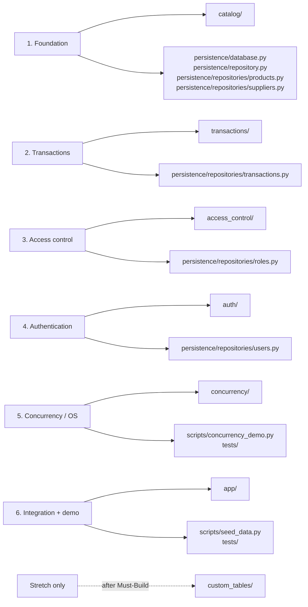

# Smart Inventory Management System

Phase 2 team project for inventory, sales, role-based access, and concurrent stock updates. The original requirements are in [readme.txt](readme.txt); the source UML is [PBL 5th sem.png](PBL%205th%20sem.png).

> **Current status:** This repository is a design scaffold. Class APIs, TODO comments, and tests are in place, but core methods are not implemented yet. The CLI and backend server will stop during startup until the `DatabaseManager` foundation is implemented.

## Start Building

Follow the short [startup guide](docs/START_HERE.md) to create the environment, install test tools, and run the tests. If a command or import fails, see [common issues](docs/TROUBLESHOOTING.md).

## Find Your Work

Choose a role and work in the matching files. Everyone works in this **same repository** so imports and shared interfaces stay consistent.



All paths in the diagram are under `src/inventory/`, except paths explicitly beginning with `scripts/` or `tests/`.

| Role | Open these files or folders |
| --- | --- |
| 1. Foundation | [catalog](src/inventory/catalog/), [DatabaseManager](src/inventory/persistence/database.py), [Repository](src/inventory/persistence/repository.py), product and supplier repositories in [persistence/repositories](src/inventory/persistence/repositories/) |
| 2. Transactions | [transactions](src/inventory/transactions/), transaction repository in [persistence/repositories](src/inventory/persistence/repositories/) |
| 3. Access control | [access_control](src/inventory/access_control/), role repository in [persistence/repositories](src/inventory/persistence/repositories/) |
| 4. Authentication | [auth](src/inventory/auth/), user repository in [persistence/repositories](src/inventory/persistence/repositories/) |
| 5. Concurrency / OS | [concurrency](src/inventory/concurrency/), [concurrency demo](scripts/concurrency_demo.py), concurrency tests in `tests/` |
| 6. Integration + demo | [app](src/inventory/app/), [seed script](scripts/seed_data.py), integration tests in `tests/` |
| Stretch | [custom_tables](src/inventory/custom_tables/) after the Must-Build work is complete |

See [the full ownership and handoff guide](docs/TEAM_SPLIT.md) before splitting work. Agree on the Repository contract before implementing repository subclasses.

## Project Shape

```text
src/inventory/
  access_control/   roles, permissions, and table grants
  app/              shared workflows, CLI, and Flask backend
  auth/             users, sessions, and authentication
  catalog/          products, suppliers, and product filters
  concurrency/      locks, retries, jobs, queue, and scheduler
  custom_tables/    stretch feature
  persistence/      database manager and entity repositories
  transactions/     sales, purchases, and stock transactions
tests/              unit and integration tests
scripts/            seed-data and demonstration entry points
docs/               startup, troubleshooting, architecture, and team split
```

## Shared Rules

- Only repository classes call `DatabaseManager` or issue database operations.
- Entities contain data and business rules; repositories contain persistence behavior.
- Implement the `TODO` in a method rather than removing its contract. Add a test for the behavior you implement.
- Use Python `snake_case` for methods and attributes, even where the UML uses camelCase.
- Leave `custom_tables/` until the Must-Build modules and concurrency demo are working.

The CLI and HTTP backend use the same service graph. Once the foundation methods are implemented, use `python -m inventory.app.main --mode cli` for the menu or install the web extra and use `python -m inventory.app.main --mode server`. Flask's built-in server is for development and demos, not production deployment.
